# 越肩相机可行性探针（第二步，独立实验）

## 结论

**受控 orientCamera 尾部矩阵介入在1.7.10可行，但不建议当前投入生产。** GOLDEN、THIRDS在本次平地默认玩家/僵尸的静止与绕身场景中实现双锚点与地平线，保守投影包围框遮挡占比0；CENTER两者居中，遮挡占比100%，失败。横向新增相机位置没有补碰撞，不能把开放场景通过当完整相机验收。第一步生产改动独立可用，第二步代码只在 tools/camera-probe，单独可选jar，不在 src/main，不改服务端。

## 源码核对与候选

对照本机实际 build/rfg/mcp_patched_minecraft-sources.jar 中 EntityRenderer 与 Forge事件类，来源SHA及断言见[source audit](evidence/camera-source-audit.json)。orientCamera、setupCameraTransform为private；updateCameraAndRender为public；没有 CameraSetup，实际事件只有FogDensity、RenderFogEvent、FogColors等。当前 usesMixins=false。

| 候选 | 能控制/代价 | 实测与冲突 |
| --- | --- | --- |
| EntityRenderer替换/子类 | 可重写public渲染入口，但private相机方法无法直接override；需复制流程、反射或其它介入才能只改机位。距离/视野/碰撞需自行接线 | 未实现；整renderer替换易与其它替换者冲突，维护1.7源码流程成本较高 |
| ASM受控尾部注入 | 原版八射线后追加modelview变换，可改横向/纵向/距离与朝向；原版FOV保留；新增横移碰撞不自动获得 | 本次实测；exact one hook断言，optional coremod jar+启动开关。其它相机transformer顺序/共存未验证 |
| Mixin回调/重定向 | 可定位目标指令或返回点，生命周期工具较规范；仍需设计新碰撞 | 未实现，须引入兼容1.7的版本、构建/启动链并测试其它coremod；不擅自启用 |
| 仅yawBias+移动输入反旋转 | 可留原版相机，无横向机位；玩家仍在屏幕中间，只是半个构图 | 因有可行矩阵路径，本次未实现/未实测，不改变移动输入 |

Mixin注入点与回调机制依据官方[Injection Point Reference](https://github.com/SpongePowered/Mixin/wiki/Injection-Point-Reference)及[Callback Injectors](https://github.com/SpongePowered/Mixin/wiki/Advanced-Mixin-Usage---Callback-Injectors)；不据此宣称某个未测版本适合本仓库。

## 做法与边界

独立 cameraProbeJar 的 IFMLLoadingPlugin 只在实验启动参数生效，transformer对 orientCamera/func_78467_g(F)V 的RETURN前插入一次调用，没有复制原版方法。只在持刀、有效锁定、背后第三人称(view=1)、无GUI及配置开启时改变矩阵；第一人称、F5前置第三人称(view=2)、关闭开关完全不写矩阵。保留原版近墙后退射线，**新增侧移/上移的碰撞没有实现**。

可配置启动属性 cw.p0.probeEnabled、cw.p0.probeDistance(4)、cw.p0.probeHeight(.5)、cw.p0.probeMaxShoulderOffset(4)。预设沿第一步camera配置，FOV与aspect取当前真实值。工具每帧读取真实GL matrices，用GLU投影玩家/目标包围盒中心和远处水平参考点，数值求解左右平移、矩阵yaw、matrix pitch使两个横向锚点和地平线吻合；yaw/pitch只改GL相机矩阵，不改玩家真实字段或已承诺朝向。

用户给出的 yawBias=atan((2*xTarget−1)*aspect*tan(vFOV/2)) 与 shoulder≈distance*tan(yawBias) 是初始估计，70°16:9约16.37°和1.175格。有限玩家/目标距离的视差下同时约束两个锚点还需数值求解：本场景GOLDEN实际横移约−1.20954格、相机矩阵yaw约−33°；THIRDS约−1.727596格、−45.6°。负号来自OpenGL视图平移约定，画面上玩家在左、目标在右。这不是攻击辅助或玩家yaw增加33°。建议文档注明公式是初始估计而不是任意机位下双锚点的精确解，由用户审核后再考虑生产接入。

求解器使用真实目标位置，未复用第一步低通，因此几何探针可能抵消部分镜头平滑；本报告证明可控制构图，不证明动态舒适或魂类手感。求解GPU/CPU耗时、云雾/裁剪/射线拾取、多相机模组共存未验证。

## 命令与过程

```powershell
.\gradlew.bat spotlessCheck checkstyleMain checkstyleTest build -I tools/p0/validation.gradle p0LaunchFiles cameraProbeJar --no-configuration-cache
python tools/p0/dual.py --label camera-probe-bounds-presets --accept-eula --composition --camera-probe
python tools/p0/camera_probe_metrics.py --label camera-probe-bounds-presets
python tools/p0/archive.py camera-probe-bounds-presets
```

真实专服+双客户端，probe jar只放客户端mods，专服客户类加载0，完整结束。每预设静止/绕身，各第一/第三视角，统一排除前2s收敛；随后约3s记录，未按结果挑帧段。工具保存原始截图，见后面的12张。0/100ms跟随动力学在第一步；本探针构图独立场景只有0ms，100ms矩阵构图未验证。

早期 camera-probe-presets 在base矩阵前插yaw导致可见地面倾斜，失败，未把单个地平线点吻合当通过；改成base之后世界Y旋转后roll基本为0。camera-probe-level-presets 的实体碰撞盒不足以覆盖默认模型手臂，最后增加保守包围框：玩家expand(.3,.1,.3)，目标expand(.8,.1,.8)。是屏幕投影外包矩形是否重叠的保守代理，不是GPU逐像素遮挡查询；本场景默认模型截图也人工判读。不同盔甲、武器、其它模型不在该代理保证内。过程摘要在[development](evidence/composition-development/)。

## 最终GLU测量

位置均以屏幕宽/高归一化。目标/玩家线与地平线容差均±.03。统计每帧，表中的误差为三个指标的最大绝对偏差；完整min/max/mean保留在[metrics](evidence/camera-probe-bounds-presets/camera-probe-metrics.json)。

| 场景 | 帧数 | 玩家X均值 | 目标X均值 | 地平线H均值 | 三项最大误差 | 保守包围框遮挡占比 |
| --- | --- | --- | --- | --- | --- | --- |
| GOLDEN_STATIC_THIRD | 175 | 0.382000029 | 0.617999971 | 0.381999075 | 0.000000925 | 0% |
| GOLDEN_ORBIT_THIRD | 173 | 0.382000000 | 0.618000096 | 0.381999993 | 0.000000925 | 0% |
| THIRDS_STATIC_THIRD | 167 | 0.333333373 | 0.666667223 | 0.333333313 | 0.000000556 | 0% |
| THIRDS_ORBIT_THIRD | 171 | 0.333333331 | 0.666666832 | 0.333333333 | 0.000000914 | 0% |
| CENTER_STATIC_THIRD | 178 | 0.500000000 | 0.500000834 | 0.500000000 | 0.000000834 | 100% |
| CENTER_ORBIT_THIRD | 174 | 0.500000000 | 0.500000003 | 0.500000012 | 0.000000894 | 100% |

GOLDEN/THIRDS静止及绕身三项全部容差内，遮挡代理0；CENTER几何锚点对齐但遮挡1，明确失败。最终roll最大约0.00000236°。PROBE_DISABLED与PROBE_F5_FRONT及所有第一人称帧，nativeMatrixError最大0，F5没有下一帧强制切回。关闭jar/配置可回到原版相机。原版鼠标、C03与服务端判定不被探针改变。

第一人称截图是原路径参考，不施加越肩构图：自身模型不呈现，玩家中心投影不代表可见模型。目标静止约.5W，绕身约.543–.545W，第一人称仍用原WEAK容差；因此第一人称不是黄金/三分双锚点通过依据。第一人称的假想玩家包围框重叠数不当成真实遮挡。地面有限区块边缘或台阶线不等同远处几何地平线。

## 逐张截图

### GOLDEN / static / first

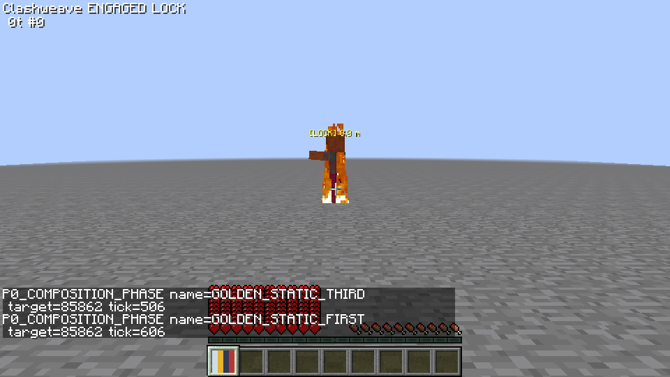

原版第一人称参考，目标可见；本视角未启用矩阵偏移，不作为双锚点验收。

### GOLDEN / static / third

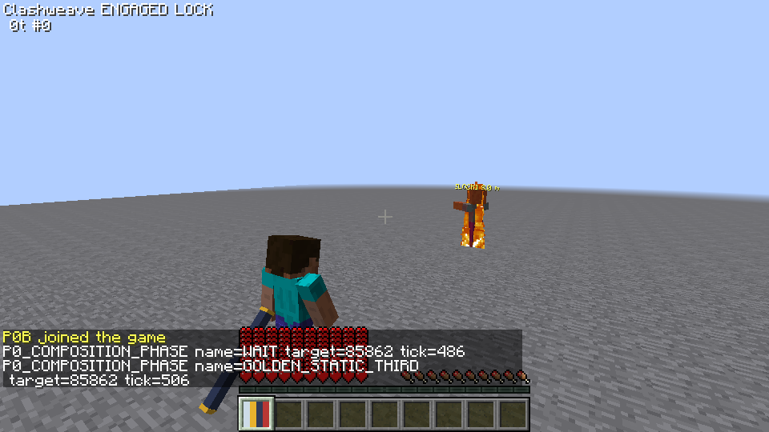

玩家位于左分割线、目标在右线且露出主体；此帧无遮挡，整体帧占比见表。

### GOLDEN / orbit / first

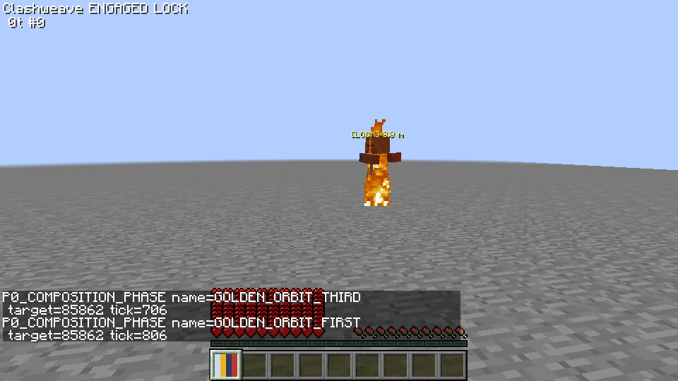

原版第一人称参考，目标可见；本视角未启用矩阵偏移，不作为双锚点验收。

### GOLDEN / orbit / third

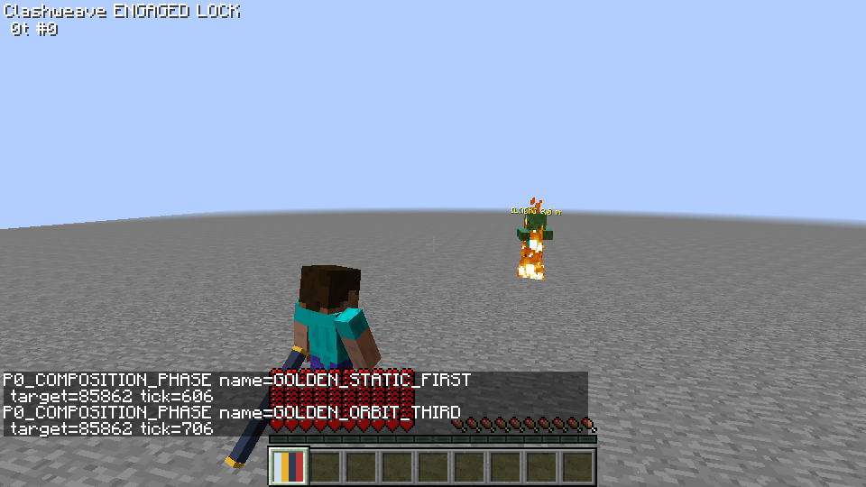

玩家位于左分割线、目标在右线且露出主体；此帧无遮挡，整体帧占比见表。

### THIRDS / static / first

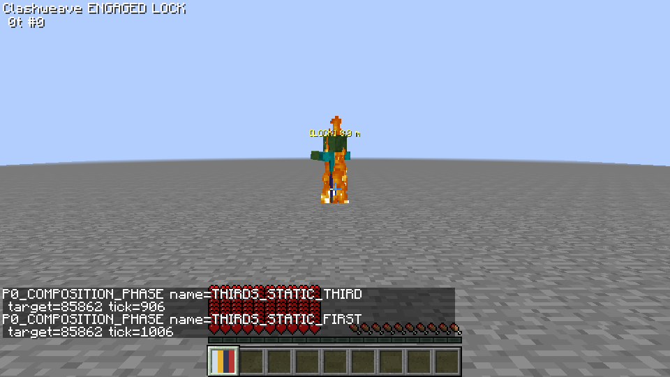

原版第一人称参考，目标可见；本视角未启用矩阵偏移，不作为双锚点验收。

### THIRDS / static / third

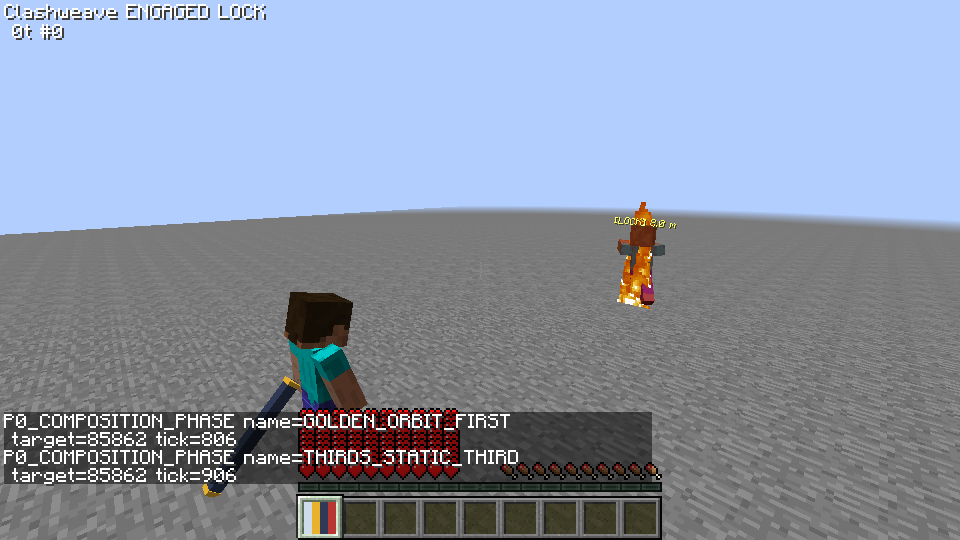

玩家位于左分割线、目标在右线且露出主体；此帧无遮挡，整体帧占比见表。

### THIRDS / orbit / first


原版第一人称参考，目标可见；本视角未启用矩阵偏移，不作为双锚点验收。

### THIRDS / orbit / third

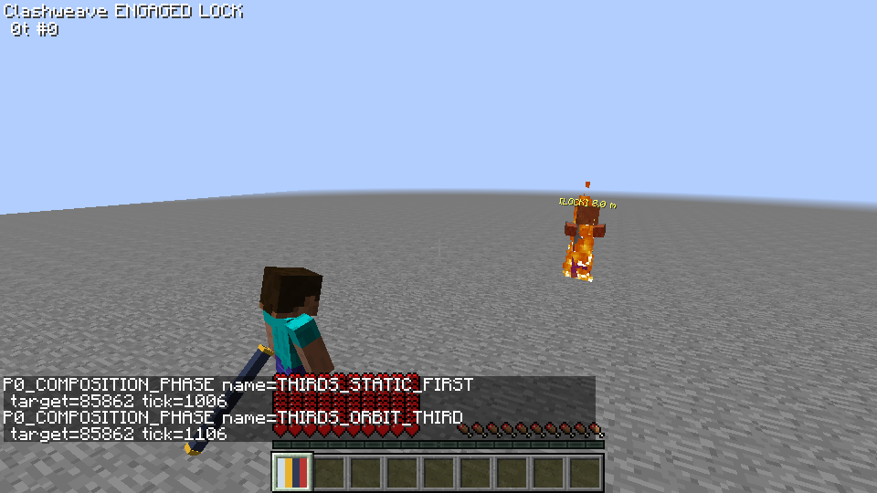

玩家位于左分割线、目标在右线且露出主体；此帧无遮挡，整体帧占比见表。

### CENTER / static / first

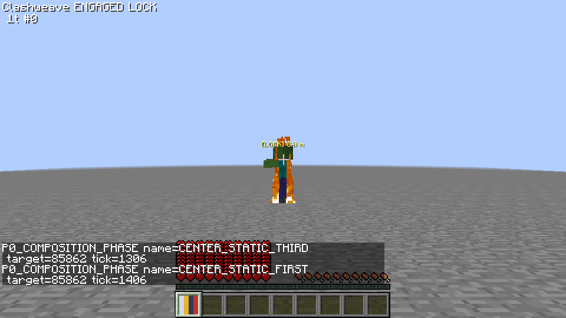

原版第一人称参考，目标可见；本视角未启用矩阵偏移，不作为双锚点验收。

### CENTER / static / third

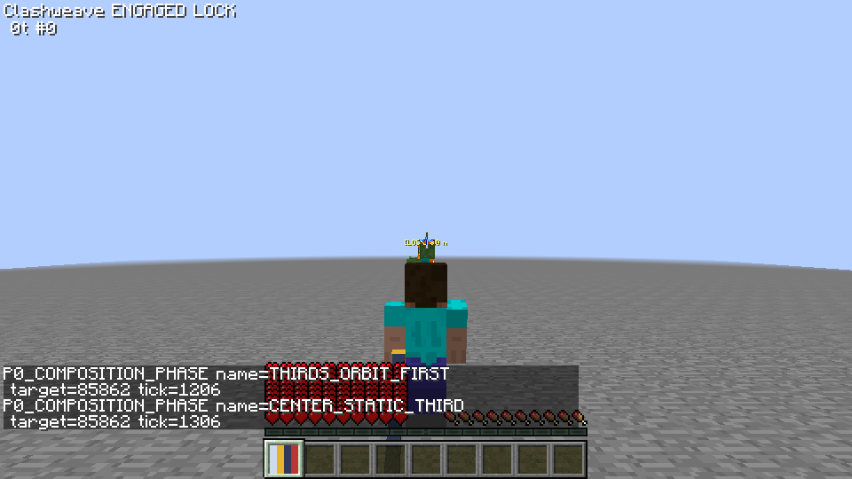

玩家居中遮住目标主体/腿部；CENTER遮挡不通过。

### CENTER / orbit / first

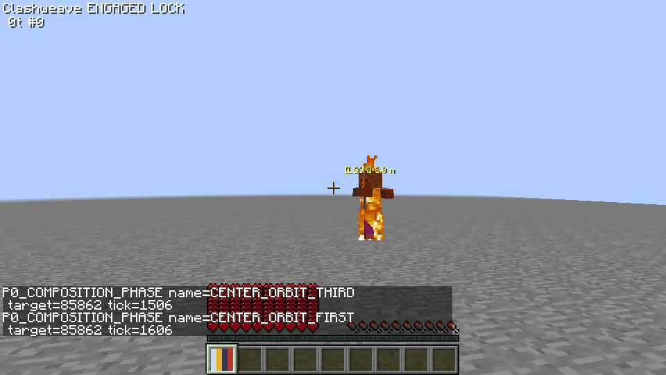

原版第一人称参考，目标可见；本视角未启用矩阵偏移，不作为双锚点验收。

### CENTER / orbit / third

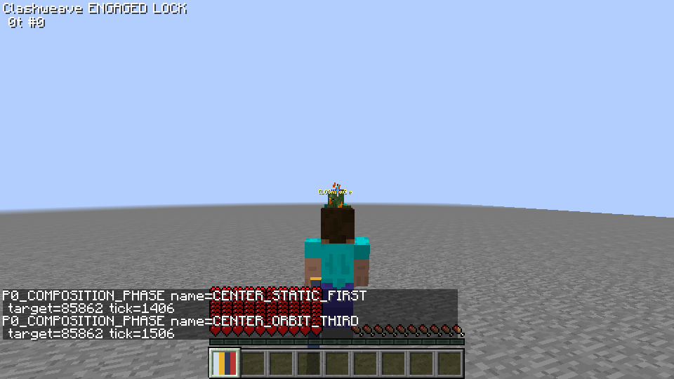

玩家居中遮住目标主体/腿部；CENTER遮挡不通过。

## 停止与建议

第一步完成并单独提交；第二步仅报告可行的开放场景矩阵控制。CENTER遮挡、新增侧移碰撞及动态平滑整合未完成，不把它带入生产；建议先审核第一步并真人选择预设，再单独决定越肩适配与碰撞方案。没有冻结API、启用Mixin、修改服务端或自动进入后续工作。
