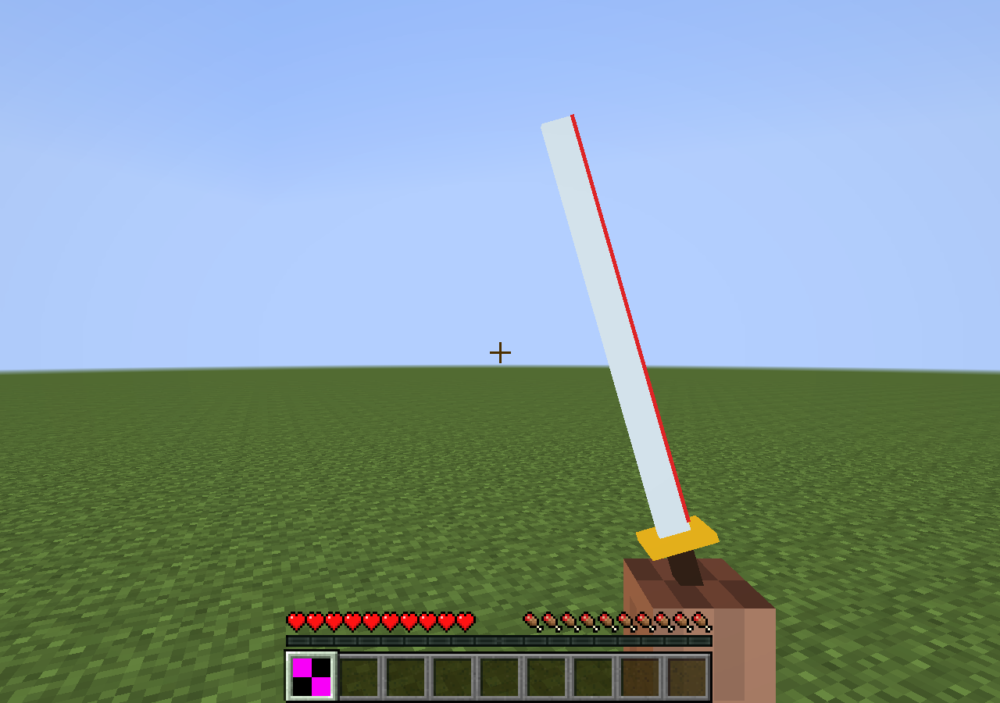
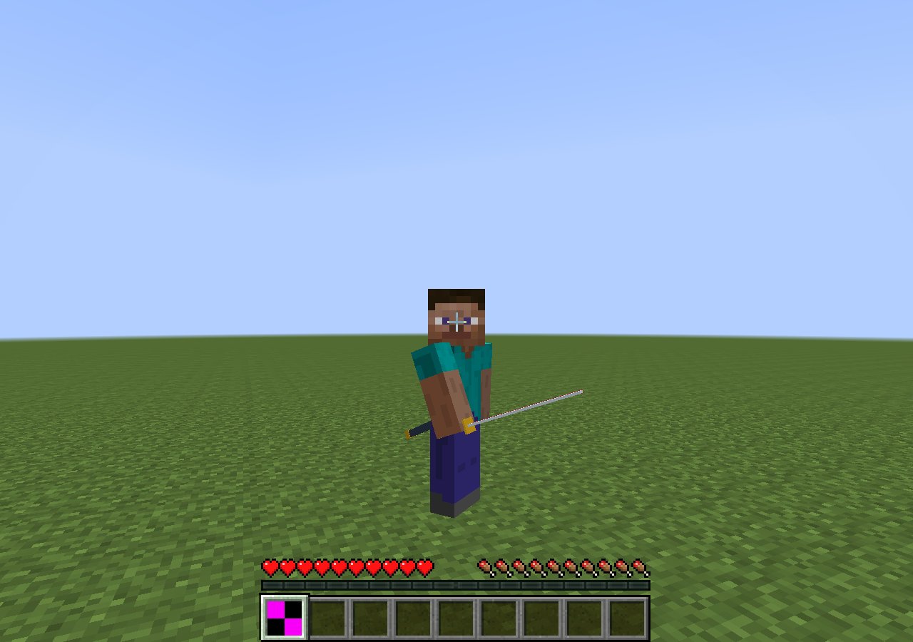
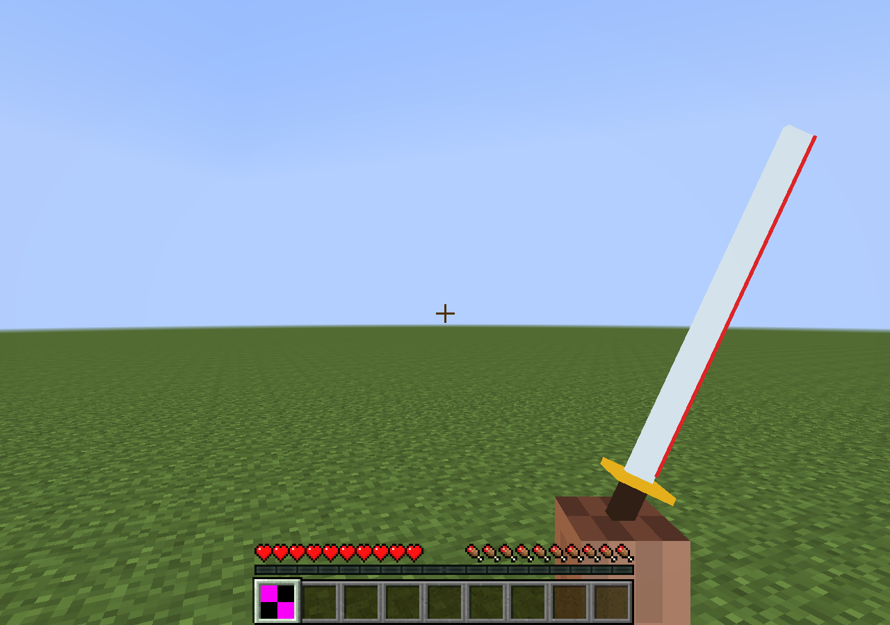
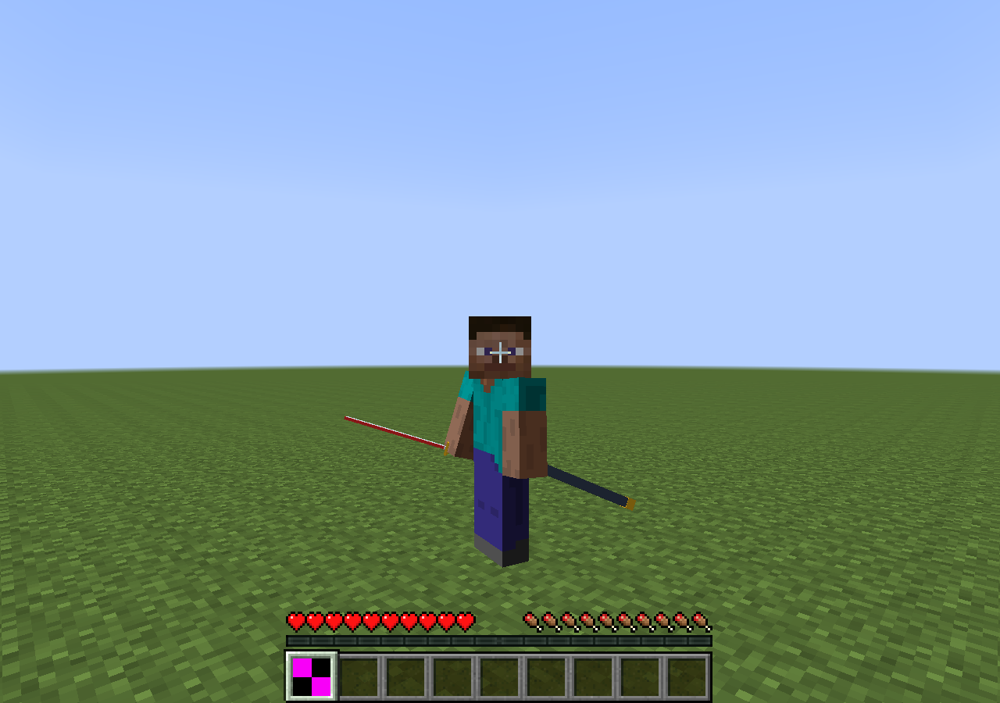

# S4b 握持：通过（静态原版手臂适配器）

## 假设与做法

第一轮只证实挂点存在，没有足够角度判断握反与否。本轮在 `tools/probes2/s4b` 的独立实验源集重写导入与挂载；不修改 `src/main`，不包含战斗或 P0 动作。真实 Forge 客户端使用 AdvancedModelLoader 导入 OBJ/PNG。第一人称通过 RenderHandEvent 显式绘制原版皮肤的 ModelBiped 右臂与手部刀挂点；第三人称在 Specials.Post 中跟随真实右臂与身体的局部矩阵，关闭重复原版持物绘制。用红色刀刃边、金色刀镡/鞘口、绿色握点校准环辨识方向。

截图直接来自 Minecraft ScreenShotHelper 的 framebuffer，未裁剪或合成。两种第一人称刀角度和两个第三人称身体角度各留一张；第三人称采用原版 `thirdPersonView=2`，让玩家身体相对前视相机旋转 ±60°，揭示被正面透视遮挡的刀与腰鞘。相机保持原版路径。这是挂点检查姿态，未宣称人体工学或正式攻击动画。

## 尺度与坐标约定

- 资源 1 单位 = 1 Minecraft 方块。刀模型握点为 `(0,0,0)`，刀尖沿 `+Y` 到 `1.12`，柄末为 `Y=-0.18`，刀镡位于 `[0.12,0.14]`；红色切刃为模型 `+X` 边。鞘口为 `(0,0,0)`，鞘长 `1.04`，轴向 `+Y`。
- 本轮程序几何直接生成游戏 Y-up OBJ。未来 Blender Z-up 源坐标统一换为 `(x,y,z) → (x,z,-y)`；这是明确的接入约定，本轮没有验证 Blender 源导出、骨架或 Root Motion。
- ModelBiped 局部单位按 `1/16` 换算；手部挂点为右臂局部 `(-0.0625,0.60,0)` 方块。第三人称刀再绕 X 转 `-90°`，刀尖朝角色前方，刀柄在手掌后方。鞘口为身体局部 `(0.30,0.65,0.04)`，位于左腰；绕 X 转 `65°`、再绕 Z 转 `-15°`，鞘向身后延伸。顺序见实验渲染器，不使用负缩放镜像。
- 第一人称独立近景表现：手臂肩端位于相机坐标 `(0.50,-1.15,-1.15)`，右臂末端按相同手部挂点挂刀；刀保持 Y-up，分别绕 Z 取 `16°`、`-25°`。近景变换不参与服务端判定。

## 命令与实测输出

```powershell
$env:JAVA_HOME='C:\Program Files\Zulu\zulu-25'
$env:VERSION='0.1.0-dev'
python tools/probes2/s4b/export_assets.py
.\gradlew.bat -I tools/probes2/s4b/experiment.gradle s4bLaunchFiles --no-configuration-cache
python tools/probes2/s4b/run_grip.py --accept-eula --label s4b-grip2
```

复跑时使用新 label；脚本拒绝覆盖已有世界与证据。首次 EULA 已由用户明确接受。服务器仅绑定 `127.0.0.1:25574`，客户端名 GripProbe。实测 Gradle `BUILD SUCCESSFUL in 1s`；运行侧使用 Java 8，Forge 10.13.4.1614。

```text
S4B_ASSET_EXPORT boxes=9 units=blocks grip_marker=green cutting_edge=red
CW2 S4B IMPORT OBJ PNG unit=block grip=(0,0,0) bladeTip=(0,1.12,0) sourceToGame=(x,z,-y)
CW2 S4B CAPTURE index=0 view=0 pose=0 tick=90
CW2 S4B CAPTURE index=1 view=0 pose=1 tick=130
CW2 S4B CAPTURE index=2 view=2 pose=0 tick=170
CW2 S4B CAPTURE index=3 view=2 pose=1 tick=210
CW2 S4B COMPLETE screenshots=4
server_exit=0 client_exit=0 screenshots=4 dedicated_client_class_loads=0
experiment_jar_sha256=5bdc93b2e5e839e78734a5143ac4ad320f827f4c108a19977e84f5a78a192d0c
```

原始启动/运行日志、命令与 jar 哈希见 [grip2 证据](evidence/s4b-grip2/summary.json)。四幅实机图已逐张读取检查：第一人称柄进入手掌、金色刀镡在手外、红色切刃沿刀身到尖；第三人称刀从右手朝前伸出，鞘口位于左腰且鞘朝身后。没有柄尖互换。

| 第一人称，两种刀角度 | 第三人称，两侧身体观察角度 |
| --- | --- |
|  |  |
|  |  |

初次 `s4b-grip1` 的四张实机图也保留：第一人称手臂在刀旁占据过多画面，第三人称正视造成刀尖严重缩短，不作为通过证据。调整近景肩端方向与第三人称观察姿态后重新编译并完整运行 grip2，没有把 grip1 图片冒充最终结果。

## 结论、限制与文档影响

S4b 按 1.2 的静态握持截图标准通过，专用服务器实际 class-load trace 中 Minecraft 客户端、OpenGL、GripClient/GripRendering 加载计数为 0。实验 jar 与源集独立，生产产物不包含它。

保留降级：原版单块手掌/躯干，无手指、蒙皮、IK、胸腰分段或正式美术；绿色握点在手掌内被遮挡属于校准位置，不能据此声称有手指抓握。第一人称不显示腰鞘，第三人称截图负责验收鞘位置。未验证盔甲、第三方玩家模型、动作中的观察叠加、远端动作同步或视觉/伤害轨迹对齐。物品栏图标未制作，截图中的缺失图标不影响 OBJ/PNG 实机挂载判断。

客户端静音隔离仍出现原版 OpenAL 后台线程的 `Only one OpenAL context` 警告；两个运行均完成四幅截图并正常退出。音频未验证。

第 1.1/S4“握持对齐未验证”和资源模块“刀不会握反”的未验收范围可收窄为本轮明确的静态原版适配器；第 7 节的完整身体层级、独立权威轨迹要求仍保留。没有结果推翻资源/视角设计。入口文档与 1.2 中的“任一失败停止其余探针”沿用旧审核；本轮按用户最新授权独立完成 S4b，不因 S1c 失败跳过，其优先级高于旧阶段闸门，但不据此进入 P0。

## 审核后补记（对本报告“通过”的修正）

本报告的“通过”只覆盖“挂点存在、刀没握反、尺度与坐标约定明确”。审核时对四张截图重看后发现位置与观感仍有问题，原审核结论对此过于宽松：

- 鞘近水平向身体外侧伸出，超出身体轮廓，不是贴腰、斜向身后下方挂着。
- 刀和鞘在第三人称下很细，刀身几乎只是一条线。
- 第三人称手臂斜过身体，刀近水平向外举着。
- 第一人称刀柄像从手臂末端戳出，而不是被握住。

这些是占位适配的观感问题，不推翻挂点与方向结论，但正式模型前必须修正；验收要求已写入[原型说明 1.2 的 P0 必带条件第 5 条](../../design/proposals/prototype-spec-v1.md)。
